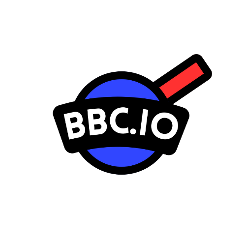

# BBC.IO

## Overview

BBC.IO is a free-for-all online multiplayer shooter game within the popular .io genre. Heavily inspired by diep.io, our game creates an online competitive environment where players control customizable tanks in an arena, shooting at other players to earn points while upgrading their capabilities.

## Objectives

Our game implements the principles of Object-Oriented Programming (OOP) in creating a complete working product that showcases all that we've learned throughout OOP2 in a simple yet engaging game format.

## Features

### Gameplay
- **Free-For-All Combat**: Battle against other players in a competitive arena
- **Real-time Multiplayer**: Play with others through UDP/TCP sockets
- **Tank Customization**: Choose colors for your tank's body, barrel, and border
- **Upgrade System**: Improve your tank's health, speed, and damage
- **Death Messages**: Humorous death notifications when players are eliminated
- **Minimap**: Track player positions across the game world
- **Score Tracking**: Compete for the highest score on the leaderboard

### Technical Features
- **Client-Server Architecture**: Robust networking using both TCP and UDP protocols
- **Efficient Collision Detection**: Using QuadTree data structure
- **Smooth Graphics**: JavaFX-based rendering with grid backgrounds and dynamic movement
- **Database Integration**: MySQL for persistent player data
- **Debug Mode**: Toggle debug information with F3

## Tech Stack

- **Java**: Primary programming language
- **JavaFX**: GUI framework for game rendering
- **MySQL**: Database for player data storage
- **UDP/TCP Sockets**: Network communication

## Getting Started

### Prerequisites

- Java 11 or higher
- JavaFX 17+
- MySQL Database
- Maven

## How to Play

### Starting the Game:

- Enter your player name on the title screen
- Click "Play" to join a game lobby

### Customize Your Tank:

- In the lobby, select colors for your tank's body, barrel, and border
- Click "Ready" to join the battle

### Controls:
- Move with WASD keys
- Aim with the mouse
- Left-click to shoot
- Press T to toggle death log visibility

### Upgrade System:

- Earn points by eliminating other players
- Use points to upgrade health, speed, or damage

### Objective:

- Survive as long as possible
- Eliminate other players
- Achieve the highest score

## Project Structure

### Client-Side (com.example.bbc package):

- User interface and game rendering
- Client-server communication
- Game controllers

### Server-Side (server package):

- Game logic processing
- Physics and collision detection
- Player management

## Future Improvements
- Additional tank types with unique abilities
- Power-up system
- Team-based game modes
- Improved matchmaking system

# Contributors
- Borgonia, John Dymier - Backend
- Emia, Seth Nathaniel - Backend
- Enario, Lance Joseph Lorenz - Frontend
- Reyes, John Zillion Reyes - Backend (Server)
- Tio, Raymond Gerard - Frontend

# Acknowledgments
- Inspiration from diep.io
- Special thanks to Mr. Jay Vince Serato
- All testers who provided valuable feedback

ahoy o/
